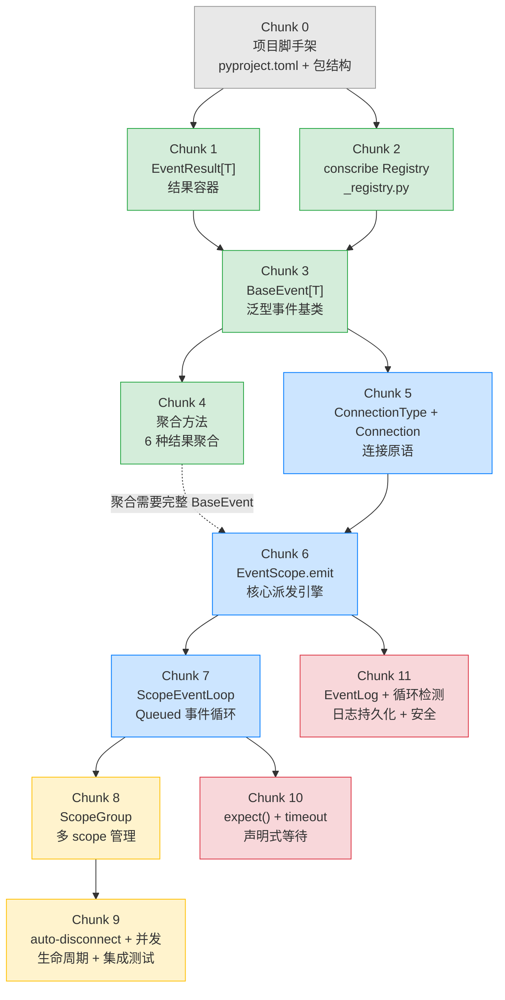
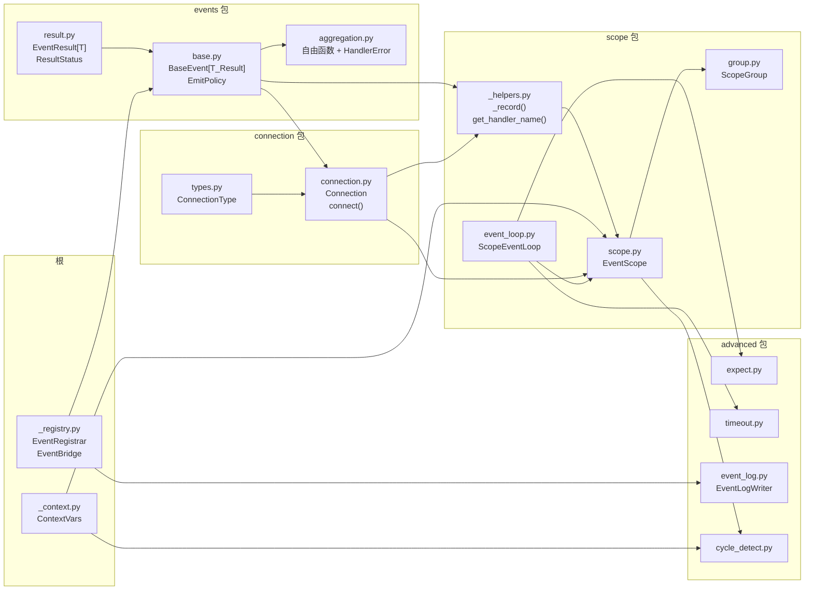

# Draft Plan: Agent 分块实施方案

> 将 Scoped Event System 拆分为可独立交付的 **12 个 Work Chunk**，每个 chunk 交由一个 agent 实现。
> 本文档定义 chunk 边界、输入输出契约、依赖关系、并行执行策略。

---

## 0. 全局 DAG



**颜色说明：** 绿色=Phase 1 事件模型 | 蓝色=Phase 2 连接与派发 | 黄色=Phase 3 生命周期 | 红色=Phase 4 高级能力

---

## 1. 并行执行时间线

```mermaid
gantt
    title Agent 并行执行时间线
    dateFormat X
    axisFormat %s

    section Phase 0
    C0 项目脚手架           :c0, 0, 1

    section Phase 1
    C1 EventResult          :c1, 1, 2
    C2 conscribe Registry   :c2, 1, 2
    C3 BaseEvent            :c3, 2, 4
    C4 聚合方法              :c4, 4, 6
    C5 Connection           :c5, 4, 6

    section Phase 2
    C6 EventScope.emit      :c6, 6, 9
    C7 ScopeEventLoop       :c7, 9, 11

    section Phase 3
    C8 ScopeGroup           :c8, 11, 13
    C9 auto-disconnect      :c9, 13, 15

    section Phase 4
    C10 expect + timeout    :c10, 11, 13
    C11 EventLog + cycle detect  :c11, 9, 11
```



**关键并行窗口：**

| 时间段 | 可并行 chunks | 说明 |
|--------|--------------|------|
| T1-T2 | C1 + C2 | EventResult 和 conscribe Registry 互不依赖 |
| T4-T6 | C4 + C5 | 聚合方法和 Connection 原语互不依赖 |
| T9-T11 | C7 + C11 | ScopeEventLoop 和 EventLog/循环检测互不依赖 |
| T11-T13 | C8 + C10 | ScopeGroup 和 expect/timeout 互不依赖 |

**最长关键路径：** C0 → C1 → C3 → C5 → C6 → C7 → C8 → C9（8 个 chunk 串行）

---

## 2. Chunk 详细定义

---

### Chunk 0 — 项目脚手架

| 属性 | 值 |
|------|------|
| **Phase** | 0 (基础设施) |
| **依赖** | 无 |
| **阻塞** | 所有后续 chunk |
| **预估复杂度** | 低 |

**产出文件：**

```
pyproject.toml                     # 更新依赖（pydantic, conscribe, uuid-utils, pytest-asyncio, ruff, pyright）
src/agent_cdp/__init__.py          # 包入口
src/agent_cdp/events/__init__.py
src/agent_cdp/connection/__init__.py
src/agent_cdp/scope/__init__.py
src/agent_cdp/advanced/__init__.py
tests/__init__.py
tests/conftest.py                  # 公共 fixtures（scope factory, event factory）
```

**验收标准：**

- `uv sync` 成功安装所有依赖
- `uv run pytest tests/` 可以运行（空测试集通过）
- `uv run ruff check` 和 `uv run pyright` 通过
- conftest.py 提供 `event_loop_policy` fixture（pytest-asyncio 配置）

---

### Chunk 1 — EventResult[T] 结果容器

| 属性 | 值 |
|------|------|
| **Phase** | 1 (事件模型) |
| **对应 Step** | 1.1 |
| **依赖** | C0 |
| **可并行** | C2 |
| **预估复杂度** | 低 |

**产出文件：**

```
src/agent_cdp/events/result.py     # EventResult[T] dataclass + ResultStatus enum
tests/test_step_1_1_event_result.py
```

**核心 API：**

```python
@dataclass(frozen=True)
class EventResult(Generic[T]):
    handler_name: str
    connection_id: str
    result: T | None = None
    error: Exception | None = None
    status: ResultStatus = ResultStatus.PENDING
    event_children: list['BaseEvent'] = field(default_factory=list)
    started_at: datetime | None = None
    completed_at: datetime | None = None

    def mark_completed(self, result: T | None = None) -> 'EventResult[T]': ...
    def mark_failed(self, error: Exception) -> 'EventResult[T]': ...
    def mark_timeout(self, error: TimeoutError) -> 'EventResult[T]': ...

class ResultStatus(str, Enum):
    PENDING = 'pending'
    COMPLETED = 'completed'
    FAILED = 'failed'
    TIMEOUT = 'timeout'
```

**设计约束：**

- 使用 `dataclass(frozen=True)` — `mark_*` 方法返回新实例（`dataclasses.replace`）
- **不用 Pydantic** — EventResult 持有 `Exception` 引用，不需要 JSON schema

**测试清单（7 个）：**

1. `test_create_pending_result` — 默认状态为 PENDING
2. `test_mark_completed` — pending → completed，result 正确
3. `test_mark_failed` — pending → failed，error 不为 None
4. `test_mark_timeout` — pending → timeout
5. `test_immutability` — mark_* 返回新实例，原实例不变
6. `test_is_success_property` — completed + no error = True
7. `test_add_child_event` — event_children 追加（frozen 下需要特殊处理或用 tuple）

---

### Chunk 2 — conscribe Registry

| 属性 | 值 |
|------|------|
| **Phase** | 1 (事件模型) |
| **对应 Step** | 1.2（前置部分） |
| **依赖** | C0 |
| **可并行** | C1 |
| **预估复杂度** | 低 |

**产出文件：**

```
src/agent_cdp/_registry.py         # EventRegistrar + EventBridge
```

**核心 API：**

```python
@runtime_checkable
class EventProtocol(Protocol):
    event_id: str
    consumed: bool

EventRegistrar = create_registrar(
    name='event',
    protocol=EventProtocol,
    discriminator_field='event_type',
    strip_suffixes=['Event'],
)

EventBridge = EventRegistrar.bridge(BaseModel)
```

**设计约束：**

- 参考 `demo_conscribe_pydantic.py`（已验证的模式）
- `skip_pydantic_generic=True` 是 conscribe 0.4 默认值
- 不需要独立测试文件 — 在 C3 的 BaseEvent 测试中验证注册行为

**验收标准：**

- `EventBridge` 的 metaclass MRO 包含 `AutoRegistrar` 和 `ModelMetaclass`
- `__abstract__ = True` 的类不注册
- Generic 特化中间类（含 `[`）不注册

---

### Chunk 3 — BaseEvent[T] 泛型事件基类

| 属性 | 值 |
|------|------|
| **Phase** | 1 (事件模型) |
| **对应 Step** | 1.2（主体） |
| **依赖** | C1 (EventResult), C2 (_registry) |
| **阻塞** | C4, C5 |
| **预估复杂度** | 高 |

**产出文件：**

```
src/agent_cdp/events/base.py       # BaseEvent[T_Result] + _make_set_event
src/agent_cdp/_context.py          # ContextVar 定义
tests/test_step_1_2_base_event.py
```

**核心 API：**

```python
class BaseEvent(EventBridge, Generic[T_Result]):
    __abstract__ = True

    event_id: str = Field(default_factory=lambda: str(uuid7()))
    event_timeout: float | None = 300.0
    consumed: bool = False
    event_parent_id: str | None = None
    event_results: dict[str, EventResult[T_Result]] = Field(default_factory=dict)

    emit_policy: ClassVar[EmitPolicy] = EmitPolicy.FAIL_FAST

    _completion: asyncio.Event = PrivateAttr(default_factory=_make_set_event)
    _pending_count: int = PrivateAttr(default=0)

    def consume(self) -> None: ...
    def record_result(self, *, connection_id, handler_name, result=None, error=None) -> None: ...
    def _increment_pending(self) -> None: ...
    def _decrement_pending(self) -> None: ...
    def __await__(self): ...
    def __deepcopy__(self, memo): ...
```

**设计约束：**

- `_completion` 构造时默认 set（出生即完成），`_increment_pending` 首次调用时 clear
- `__deepcopy__` 确保副本获得独立的 `asyncio.Event`
- `record_result` 接受原始类型（keyword-only），不依赖 Connection
- `EmitPolicy` 枚举定义在 `connection/types.py`（C5），但此处以 `ClassVar` 引用
  - **注意**：C3 需要 EmitPolicy 的前向声明或将 EmitPolicy 放在 events 包内

**Agent 特别指示：**

- EmitPolicy 枚举虽然逻辑上属于 Connection 层，但 BaseEvent 需要引用它作为 ClassVar。
  建议在 `events/base.py` 中定义 EmitPolicy，后续 C5 从这里导入。
  或者新建 `events/types.py` 存放 EmitPolicy。

**测试清单（9 个）：**

1. `test_create_event_default_fields` — event_id 自动生成，consumed=False
2. `test_consume_sets_flag` — consume() 设置 consumed=True
3. `test_record_result_stores_in_dict` — 按 connection_id 存储
4. `test_record_result_with_error` — error 结果正确
5. `test_await_completes_when_no_pending` — pending=0 → await 立即返回
6. `test_await_blocks_until_pending_zero` — pending=2 → decrement 两次后完成
7. `test_parent_id_tracking` — 设置 event_parent_id
8. `test_event_subclass_auto_registers` — conscribe 自动注册验证
9. `test_event_registrar_lookup` — EventRegistrar.get('xxx') 查找

---

### Chunk 4 — 6 种结果聚合方法

| 属性 | 值 |
|------|------|
| **Phase** | 1 (事件模型) |
| **对应 Step** | 1.3 |
| **依赖** | C3 (BaseEvent) |
| **可并行** | C5 |
| **预估复杂度** | 中 |

**产出文件：**

```
src/agent_cdp/events/aggregation.py # 6 种聚合自由函数 + HandlerError（已从 BaseEvent 提取）
tests/test_step_1_3_aggregation.py
```

**核心 API（6 个 async 聚合方法）：**

| 方法 | 返回类型 | 用途 |
|------|---------|------|
| `event_result()` | `T_Result \| None` | 第一个非 None 成功结果 |
| `event_results_list()` | `list[T_Result]` | 所有成功结果列表 |
| `event_results_by_handler_name()` | `dict[str, T_Result]` | 按 handler 名分组 |
| `event_results_flat_dict()` | `dict[str, Any]` | 合并所有 dict 结果 |
| `event_results_flat_list()` | `list[Any]` | 合并所有 list 结果 |
| `event_results_filtered()` | `dict[str, EventResult]` | 自定义过滤 |

**加上内部方法：**

| 方法 | 用途 |
|------|------|
| `_wait_for_completion(timeout)` | 等待所有 handler 完成，fallback 到 event_timeout |

**设计约束：**

- **聚合方法为自由函数**（设计评审后变更）——不再是 BaseEvent 方法，而是 `events/aggregation.py` 中接受 `BaseEvent` 作为第一参数的 `async` 函数
- 调用方式从 `await event.event_result()` 变为 `await event_result(event)`
- `HandlerError` 异常类定义在 `aggregation.py` 中，通过 `events/__init__.py` 导出
- `raise_if_any=True` 时 raise `HandlerError(original_error, handler_name, connection_id)`
- `flat_dict` 默认 `raise_if_conflicts=True`

**测试清单（17 个）：**

```
# event_result()
test_event_result_returns_first_non_none
test_event_result_raise_if_any_error
test_event_result_raise_if_none_all_none
test_event_result_no_raise_if_none

# event_results_list()
test_results_list_excludes_none
test_results_list_preserves_order

# event_results_by_handler_name()
test_results_by_handler_name_mapping
test_results_by_handler_name_duplicate_names

# event_results_flat_dict()
test_flat_dict_merges_non_overlapping
test_flat_dict_raises_on_conflict
test_flat_dict_allows_override_when_no_raise

# event_results_flat_list()
test_flat_list_concatenates
test_flat_list_skips_non_iterable

# event_results_filtered()
test_filtered_with_default_truthy
test_filtered_with_custom_predicate
test_filtered_empty_results

# timeout
test_aggregation_timeout_raises
test_aggregation_respects_event_timeout
```

---

### Chunk 5 — ConnectionType + Connection + connect()

| 属性 | 值 |
|------|------|
| **Phase** | 2 (连接与派发) |
| **对应 Step** | 2.1 |
| **依赖** | C3 (BaseEvent — 类型引用) |
| **可并行** | C4 |
| **预估复杂度** | 中 |

**产出文件：**

```
src/agent_cdp/connection/types.py       # ConnectionType 枚举
src/agent_cdp/connection/connection.py  # Connection dataclass + connect() 函数
tests/test_step_2_1_connection.py
```

**核心 API：**

```python
class ConnectionType(str, Enum):
    DIRECT = 'direct'
    QUEUED = 'queued'
    AUTO   = 'auto'

@dataclass(frozen=True)
class Connection:
    id: str
    source_scope: weakref.ref['EventScope']
    event_type: type[BaseEvent]
    handler: Callable
    target_scope: weakref.ref['EventScope'] | None
    mode: ConnectionType
    filter: Callable[[BaseEvent], bool] | None
    priority: int
    _active: bool = field(default=True, repr=False)

    def disconnect(self) -> None: ...

def connect(source, event_type, handler, *, mode=AUTO, target_scope=None, priority=0, filter=None) -> Connection: ...
```

**设计约束：**

- `Connection` 使用 `frozen=True`，`disconnect()` 通过 `object.__setattr__` 修改 `_active`
- `source_scope` 和 `target_scope` 使用 `weakref.ref` 避免循环引用
- EmitPolicy 已在 C3 中定义，此处从 events 包导入

**测试清单（8 个）：**

1. `test_create_connection_via_connect`
2. `test_connection_is_frozen`
3. `test_disconnect_sets_inactive`
4. `test_disconnect_removes_from_scope`
5. `test_weakref_scope_reference`
6. `test_connection_with_filter`
7. `test_connection_with_priority`
8. `test_connection_type_enum_values`

---

### Chunk 6 — EventScope 核心（emit + connection 管理）

| 属性 | 值 |
|------|------|
| **Phase** | 2 (连接与派发) |
| **对应 Step** | 2.2 |
| **依赖** | C5 (Connection), C3 (BaseEvent), C4 (聚合方法完成后集成更稳) |
| **阻塞** | C7, C11 |
| **预估复杂度** | **最高** — 这是整个系统最核心的代码 |

**产出文件：**

```
src/agent_cdp/scope/scope.py       # EventScope 类
src/agent_cdp/scope/_helpers.py    # _record helper + get_handler_name
tests/test_step_2_2_scope_emit.py
```

**核心 API：**

```python
class EventScope:
    scope_id: str
    metadata: dict[str, Any]

    _connections_by_type: dict[type[BaseEvent], list[Connection]]
    _catch_all_connections: list[Connection]
    _incoming: list[Connection]
    _event_loop: ScopeEventLoop  # 此时 stub，C7 实现

    def connect(self, event_type, handler, *, mode=AUTO, ...) -> Connection: ...
    def connect_all(self, handler, *, mode=AUTO, ...) -> Connection: ...
    def emit(self, event: BaseEvent) -> BaseEvent: ...
    async def close(self) -> None: ...

    def _get_matching_connections(self, event) -> list[Connection]: ...
    def _resolve_mode(self, conn) -> ConnectionType: ...
    def _add_connection(self, conn) -> None: ...
    def _remove_connection(self, conn) -> None: ...
```

**设计约束：**

- `emit()` 是 **sync 函数**（不是 async）
- Direct handler 必须是 sync — 如果返回 awaitable，raise TypeError
- MRO 索引匹配：遍历 `type(event).__mro__` 收集匹配连接
- `connect(BaseEvent, ...)` → TypeError，必须用 `connect_all()`
- `_catch_all_connections` 独立于 `_connections_by_type`
- ContextVar 父子追踪在 emit 中实现
- EmitPolicy 控制 Direct handler 异常行为
- **Direct handler 执行时间监测**（设计评审后补充）：`_dispatch_direct` 使用 `time.monotonic()` 监测 handler 执行时间，超过 100ms 输出 warning（含 handler 名、scope ID、event type）

**Agent 特别指示：**

- C6 需要一个 `ScopeEventLoop` stub（仅提供 `enqueue` 方法）供 Queued 入队使用。
  完整的 ScopeEventLoop 在 C7 中实现。
- `_helpers.py` 中的 `_record` helper 是 Connection → primitives 的唯一拆解点。

**测试清单（25+ 个）：**

```
# Direct 派发
test_direct_handler_executes_synchronously
test_direct_handler_must_be_sync
test_direct_handler_result_recorded
test_direct_handler_exception_recorded_and_propagated

# EmitPolicy
test_fail_fast_stops_on_exception
test_collect_errors_continues_on_exception
test_collect_errors_all_errors_in_results
test_emit_policy_inherited_from_event_class

# has_pending
test_has_pending_false_when_no_queued
test_has_pending_true_when_queued_enqueued

# Priority
test_handlers_execute_by_priority_descending
test_same_priority_preserves_registration_order

# Consume
test_consume_stops_subsequent_handlers
test_consume_only_affects_current_emit
test_consume_orthogonal_to_emit_policy

# Filter
test_filter_skips_non_matching_events
test_filter_passes_matching_events

# MRO 索引匹配
test_subclass_event_matches_parent_connection
test_exact_type_also_matches
test_mro_collects_connections_at_each_level
test_connect_base_event_raises_type_error
test_connect_all_matches_all_events
test_catch_all_not_in_connections_by_type
test_catch_all_respects_priority
test_connect_validates_event_type

# Auto 模式
test_auto_same_scope_uses_direct
test_auto_cross_scope_uses_queued
test_auto_no_target_scope_uses_direct

# ContextVar 父子追踪
test_parent_id_set_when_emit_inside_handler
test_no_parent_id_when_top_level_emit
```

---

### Chunk 7 — ScopeEventLoop（Queued 事件处理循环）

| 属性 | 值 |
|------|------|
| **Phase** | 2 (连接与派发) |
| **对应 Step** | 2.3 |
| **依赖** | C6 (EventScope — 替换 stub) |
| **阻塞** | C8, C10 |
| **可并行** | C11 |
| **预估复杂度** | 中 |

**产出文件：**

```
src/agent_cdp/scope/event_loop.py  # ScopeEventLoop 完整实现
tests/test_step_2_3_event_loop.py
```

**核心 API：**

```python
class ScopeEventLoop:
    _queue: asyncio.Queue[tuple[BaseEvent, Connection]]
    _task: asyncio.Task | None
    _running: bool

    async def start(self) -> None: ...
    async def stop(self, drain: bool = True) -> None: ...
    def enqueue(self, event, connection) -> None: ...

    async def _run(self) -> None: ...
    async def _execute_handler(self, event, conn) -> None: ...
```

**设计约束：**

- 替换 C6 中的 ScopeEventLoop stub
- `_execute_handler` 设置 ContextVar，await handler，record_result，decrement_pending
- handler 异常不 crash event loop — 总是 catch 并 record
- `stop(drain=True)` 处理完剩余事件，`stop(drain=False)` 丢弃并 decrement
- **背压控制**（设计评审后补充）：asyncio.Queue 默认 `maxsize=1024`（safe by default），满队列时 drop-newest + warning（含 queue size 和 event type）。需要无界队列时调用方显式 `maxsize=0`

**测试清单（9 个）：**

1. `test_queued_handler_executes_async`
2. `test_queued_handlers_execute_in_order`
3. `test_queued_handler_result_recorded`
4. `test_queued_handler_exception_recorded`
5. `test_await_event_waits_for_queued`
6. `test_stop_drain_processes_remaining`
7. `test_stop_no_drain_discards_remaining`
8. `test_mixed_direct_queued`
9. `test_context_var_parent_tracking_in_queued`

---

### Chunk 8 — ScopeGroup（多 scope 管理）

| 属性 | 值 |
|------|------|
| **Phase** | 3 (生命周期) |
| **对应 Step** | 3.1 |
| **依赖** | C7 (ScopeEventLoop 完整) |
| **阻塞** | C9 |
| **可并行** | C10 |
| **预估复杂度** | 中 |

**产出文件：**

```
src/agent_cdp/scope/group.py       # ScopeGroup 类
tests/test_step_3_1_scope_group.py
```

**核心 API：**

```python
class ScopeGroup:
    group_id: str
    _scopes: dict[str, EventScope]

    def create_scope(self, scope_id, **metadata) -> EventScope: ...
    async def close_scope(self, scope_id) -> None: ...
    def get_scope(self, scope_id) -> EventScope: ...
    def broadcast(self, event, *, exclude=None) -> list[BaseEvent]: ...
    def connect_all_scopes(self, event_type, handler, *, mode=AUTO, ...) -> list[Connection]: ...
    async def close_all(self) -> None: ...
```

**设计约束：**

- `broadcast()` 对每个 scope 深拷贝事件（`model_copy(deep=True)`）
- `create_scope()` 自动启动 event loop
- `connect_all_scopes` 是 ScopeGroup 级别的"所有 scope"，区别于 EventScope.connect_all 的"所有事件类型"

**测试清单（8 个）：**

1. `test_create_scope_and_retrieve`
2. `test_close_scope_removes_from_group`
3. `test_broadcast_reaches_all_scopes`
4. `test_broadcast_deep_copies_event`
5. `test_broadcast_exclude_skips_scope`
6. `test_connect_all_scopes_connects_to_every_scope`
7. `test_close_all_closes_every_scope`
8. `test_scope_count_and_ids`

---

### Chunk 9 — auto-disconnect + 并发验证

| 属性 | 值 |
|------|------|
| **Phase** | 3 (生命周期) |
| **对应 Step** | 3.2 |
| **依赖** | C8 (ScopeGroup) |
| **阻塞** | 无（终端节点） |
| **预估复杂度** | 中 |

**产出文件：**

```
src/agent_cdp/scope/scope.py       # 完善 close() 的 auto-disconnect
src/agent_cdp/connection/connection.py  # 完善 disconnect 通知
tests/test_step_3_2_lifecycle.py    # 集成测试
```

**核心验证场景：**

```python
# auto-disconnect
await group.close_scope('tab1')
assert not conn_out.active   # outgoing 断开
assert not conn_in.active    # incoming 断开

# 并发
results = await asyncio.gather(
    emit_and_await(tab1, NavEvent(url='a')),
    emit_and_await(tab2, NavEvent(url='b')),
)
# 各 scope 结果互不混淆
```

**测试清单（7 个）：**

1. `test_close_scope_disconnects_outgoing`
2. `test_close_scope_disconnects_incoming`
3. `test_emit_after_close_raises_or_noop`
4. `test_handler_refs_released_after_close`
5. `test_parallel_emit_across_scopes`
6. `test_no_global_lock_bottleneck`
7. `test_concurrent_scope_creation_and_close`
8. `test_cross_scope_direct_queued_alternating_chain` — 跨 scope 的 Direct-Queued 交替链 parent_id 正确性验证（设计评审后补充）

---

### Chunk 10 — expect() + per-handler 超时 + 死锁监测

| 属性 | 值 |
|------|------|
| **Phase** | 4 (高级能力) |
| **对应 Step** | 4.1 |
| **依赖** | C7 (ScopeEventLoop) |
| **可并行** | C8 |
| **预估复杂度** | 中 |

**产出文件：**

```
src/agent_cdp/advanced/expect.py   # expect() 实现
src/agent_cdp/advanced/timeout.py  # per-handler 超时增强
tests/test_step_4_1_expect_timeout.py
```

**核心 API：**

```python
# expect() — 在 EventScope 上扩展
async def expect(self, event_type, *, include=..., exclude=..., timeout=None) -> T_Event:
    # 临时 Direct 连接 + asyncio.Future
    ...

# per-handler 超时 — 在 ScopeEventLoop._execute_handler 中增强
async def _execute_handler(self, event, conn):
    deadlock_monitor = asyncio.create_task(self._deadlock_warning(handler, delay=15.0))
    try:
        result = await asyncio.wait_for(handler(event), timeout=timeout)
        ...
    finally:
        deadlock_monitor.cancel()
        event._decrement_pending()
```

**设计约束：**

- expect() 用临时 Direct 连接 + asyncio.Future 实现
- expect() 返回后自动 disconnect 临时连接
- Direct handler 不做框架级超时控制（文档约定 < 100ms）

**测试清单（9 个）：**

1. `test_expect_returns_matching_event`
2. `test_expect_with_include_filter`
3. `test_expect_with_exclude_filter`
4. `test_expect_timeout_raises`
5. `test_expect_auto_disconnects`
6. `test_handler_timeout_records_error`
7. `test_handler_timeout_cancels_children`
8. `test_deadlock_warning_logged`
9. `test_direct_handler_no_timeout_enforcement`

---

### Chunk 11 — EventLog + 循环检测 + 事件历史

| 属性 | 值 |
|------|------|
| **Phase** | 4 (高级能力) |
| **对应 Step** | 4.2 |
| **依赖** | C6 (EventScope — emit 中加 depth 检查), C2 (_registry — EventLog 反序列化) |
| **可并行** | C7 |
| **预估复杂度** | 中 |

**产出文件：**

```
src/agent_cdp/advanced/event_log.py    # EventLogWriter — per-scope JSONL 事件日志（原名 WAL，设计评审后更正为 EventLog）
src/agent_cdp/advanced/cycle_detect.py # Direct 连接链深度限制
tests/test_step_4_2_event_log_cycle.py
```

**核心 API：**

```python
# EventLog（原名 WAL，设计评审后更正）
class EventLogWriter:
    def __init__(self, path: Path): ...
    async def write(self, event: BaseEvent) -> None: ...
    async def read_all(self) -> list[BaseEvent]: ...  # 使用 EventRegistrar 反序列化

# 循环检测
_MAX_DIRECT_DEPTH = 16
_emit_depth: ContextVar[int] = ContextVar('_emit_depth', default=0)
# 在 EventScope.emit() 中增加 depth 检查
```

**设计约束：**

- EventLog 反序列化通过 `EventRegistrar.get(event_type_name)` 查找 class — conscribe 核心价值点
- 当前实现是 write-behind（事件完成后写入），不是 write-ahead。命名从 WAL 更正为 EventLog 以避免概念混淆
- 循环检测通过 ContextVar `_emit_depth` 实现，仅影响 Direct 连接链
- Queued 入队不增加深度（异步执行，不在调用栈中）

**测试清单（9 个）：**

1. `test_event_log_write_jsonl_format`
2. `test_event_log_read_all_deserializes`
3. `test_event_log_per_scope_isolation`
4. `test_event_log_empty_file`
5. `test_direct_cycle_raises_recursion_error`
6. `test_queued_does_not_trigger_cycle_check`
7. `test_depth_limit_configurable`
8. `test_scope_event_history_records`
9. `test_event_history_max_size`

---

## 3. Chunk 间接口契约

每个 chunk 的输入/输出类型明确，后续 chunk 依赖前序 chunk 的 **公共 API**（非实现细节）。



---

## 4. 每个 Chunk 的 Agent 执行策略

| Chunk | Agent 类型 | 预期 Token 预算 | TDD 要求 |
|-------|-----------|----------------|---------|
| C0 | general-purpose | 低 | conftest 验证 |
| C1 | tdd-guide | 低 | 7 个测试先行 |
| C2 | general-purpose | 低 | 无独立测试 |
| C3 | tdd-guide | 中-高 | 9 个测试先行 |
| C4 | tdd-guide | 中 | 17 个测试先行 |
| C5 | tdd-guide | 中 | 8 个测试先行 |
| C6 | tdd-guide + architect | **高** | 25+ 个测试先行 |
| C7 | tdd-guide | 中 | 9 个测试先行 |
| C8 | tdd-guide | 中 | 8 个测试先行 |
| C9 | tdd-guide | 中 | 7 个集成测试 |
| C10 | tdd-guide | 中 | 9 个测试先行 |
| C11 | tdd-guide | 中 | 9 个测试先行 |

---

## 5. 风险与缓解

| 风险 | 影响 Chunk | 缓解措施 |
|------|-----------|---------|
| EmitPolicy 放置位置——events 还是 connection | C3, C5 | C3 agent 定义 EmitPolicy，C5 从 events 导入 |
| C6 的 ScopeEventLoop stub 与 C7 接口不一致 | C6, C7 | C6 agent 必须定义明确的 ScopeEventLoop Protocol/ABC |
| `frozen=True` dataclass 的 `disconnect()` mutation | C5 | 用 `object.__setattr__` 或改为 `slots=True` 非 frozen |
| C11 需要修改 C6 的 `emit()` 加入 depth 检查 | C6, C11 | C11 agent 通过 monkey-patch 或 decorator 注入，不修改 C6 核心逻辑 |
| conftest.py 中的 fixtures 随 chunk 演进 | 所有 | 每个 chunk 的 agent 可以向 conftest.py 追加 fixtures |

**已缓解的风险（设计评审后）：**

| 风险 | 原始影响 | 缓解措施 |
|------|---------|---------|
| BaseEvent God Object（职责过多） | C3, C4 | 聚合方法提取为自由函数，BaseEvent 从 ~300 行缩减到 ~158 行 |
| Queued 队列无界导致 OOM | C7 | ScopeEventLoop 默认 maxsize=1024，满队列 drop-newest + warning |
| Direct handler 执行时间无监控 | C6 | time.monotonic() 监测，>100ms 输出 warning |
| WAL 命名与实际语义不符 | C11 | 重命名为 EventLog（write-behind 不是 write-ahead） |
| ContextVar 跨 scope 交替链语义 | C9 | 验证 parent_id 在 emit 时确定（正确），补充集成测试 |

---

## 6. 总结

| 指标 | 值 |
|------|------|
| 总 Chunk 数 | 12（含 C0 脚手架） |
| 最大并行度 | 2（四个并行窗口） |
| 关键路径长度 | 8 chunks |
| 总测试数 | ~112 个 |
| 最复杂 Chunk | C6（EventScope.emit） |
| 最大风险点 | C3 + C5 的 EmitPolicy 接口约定 |
